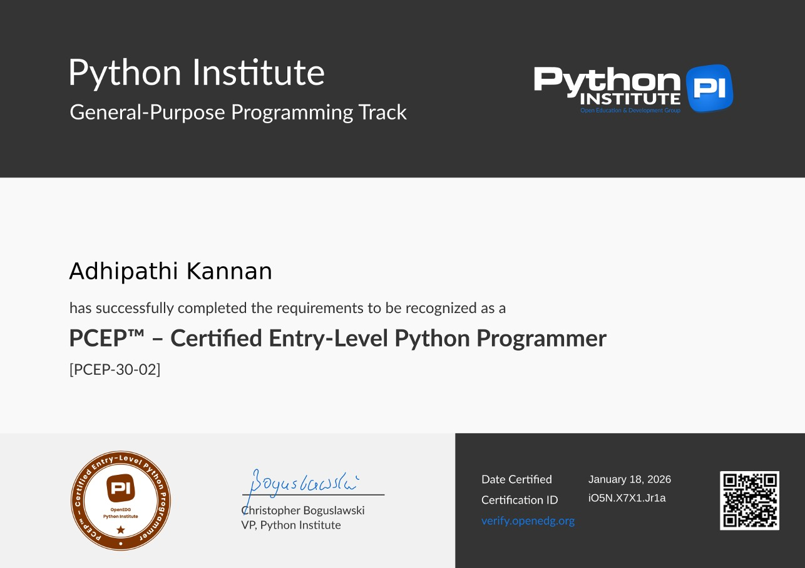

# PCEP – Certified Entry-Level Python Programmer (PCEP-30-02)

This repository contains my personal study notes and Jupyter notebook that I used to prepare for the **PCEP™ – Certified Entry-Level Python Programmer (PCEP-30-02)** certification.

## 📚 Topics Covered

- Python Basics
- Variables and Data Types
- Operators
- Input and Output
- Conditional Statements
- Loops
- Functions
- Lists, Tuples, and Dictionaries
- Strings
- Exception Handling

## 🏆 Certification

I successfully earned the **PCEP™ – Certified Entry-Level Python Programmer (PCEP-30-02)** certification.

## 💙 Why I Shared This

I started learning Python from scratch, and these notes helped me understand the fundamentals and pass the PCEP certification.

If you're preparing for the exam or just beginning your Python journey, I hope these notes make your learning a little easier.

Keep learning, stay consistent, and never give up. Every expert was once a beginner.

Happy Coding! 🚀

---

**Author:** Adhipathi Kannan
